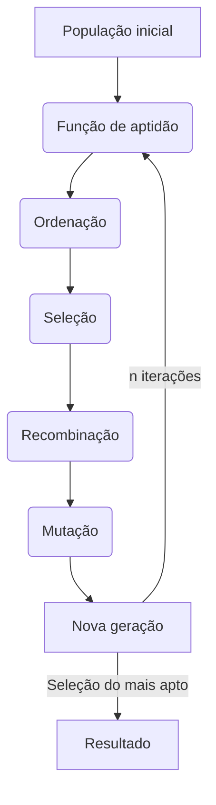

# Algoritmo Genético

Este projeto procura resolver o problema do caixeiro viajante através da utilização de um algoritmo genético. Dada a natureza do algoritmo o resultado não é garantido de ser ideal, ao invés disso, procura um resultado satisfatório através de uma aproximação, tomando como base para seu funcionamento, a teoria da evolução de Charles Darwin.


## Problema do caixeiro viajante

Um caixeiro viajante tem de visitar *n* cidades diferentes, sua viajem deve encerrar na mesma cidade em que partiu. Existe uma distância a ser percorrida entre um cidade e outra. Outro detalhe importante é, no caso deste projeto, supomos que partindo de uma cidade pode-se ir diretamente a qualquer outra.

Dado este cenário, o problema consiste em descobrir a rota que **passa por todas as cidades** e que possui a **menor distância**.

**Exemplo**: Temos quatro cidades A, B, C e D (n=4). Partindo da cidade A, as seguintes rotas são possíveis:

- ABCDA
- ABDCA
- ACBDA
- ACDBA
- ADBCA
- ADCBA

Considerando uma certa distância entre cada par de cidades, qual rota terá a menor distância total percorrida?


### Possíveis formas de se resolver o problema

- Método exaustivo (força bruta)
- Algoritmo do vizinho mais próximo
- Algoritmo repetitivo do vizinho mais próximo
- Algoritmo da ligação mais econômica
- Árvore geradora mínima
- Algoritmo genético
- ...

A ideia do algoritmo genético para este caso, é fazer uma analogia entre cidades e genes, cada combinação de rota é uma é um indivíduo com uma combinação genética, medimos a distância da rota para analisar a qualidade, ou, adaptabilidade do indivíduo.

O indivíduo mais adaptado é então eleito como sendo a rota/resultado mais razoável encontrada pelo algoritmo para resolver o problema.


## Funcionamento do algoritmo



1. Criação da população inicial

	Aqui é onde são criados os primeiros indivíduos, sua configuração será gerada aleatóriamente, neste caso, para cada população, serão gerados 20 indivíduos.

2. Criação de uma nova geração

	1. Função de adaptação (*fitness*)

		Para medir a qualidade de um indivíduo é necessário uma função matemática, este número deve ser minimizado ou maximizado dependendo do problema a ser resolvido. No problema do caixeiro viajante utilizamos a soma das distâncias entre as cidades do percurso como métrica de avaliação, sendo assim, o objetivo é minimizar o número final.

	2. Ordenação e seleção dos pais

		Com todos os indivíduos avaliados, ordenamos a população do mais apto ao menos apto, então, selecionamos a metade mais apta da população para serem os pais da próxima geração e descartamos a outra metade.

	3. Recombinação (*crossover*)

		A recombinação nada mais é do que a troca dos "genes" entre um dois indivíduos em um novo indivíduo gerado, existem várias formas de realizar esta recombinação, neste caso a seleção é feita de forma aleatória, os genes que forem selecionados do 1° pai serão colocados no novo indivíduo e o restante será preenchido pelo 2° pai.

	4. Mutação

		É feita a troca de dois "genes" (ou cidades no problema do caixeiro viajante) de forma aleatória na ordem de configuração de um indivíduo, se a configuração da rota for, por exemplo, ADCB, e for selecionado o A e o C, a configuração após a mutação ficaria CDAB.

	Este processo é feito com todos os pais até que a população esteja completa novamente.

3. Critério de parada

	Ao final do passo 2, a nova população é usada para gerar a próxima e assim sucessivamente. O critério de parada usado é após 10 mil gerações, ao final da execução o indivíduo mais apto da última geração é selecionado como sendo a melhor solução encontrada para o problema.


## Exemplos de indivíduos gerados

O número abaixo indica a aptidão/qualidade do indivíduo.

|  |  |  |
|:---:|:---:|:---:|
|  3.476499380824559 |  3.596476424283651 |  3.706061731483820 |
|  4.107383238636668 |  4.186196488390991 |  4.448049941270266 |


## Como rodar o projeto

É possível rodar o código utilizando uma plataforma web como [Jupyter Notebook](https://jupyter.org/) ou [Google Colab](https://colab.google/).

Caso queira rodar o código em sua própria máquina certifique-se antes de ter [python3](https://www.python.org/downloads/) e [git](https://git-scm.com/downloads) instalados.

1. Abra o terminal e faça o download do projeto com o comando:
```bash
git clone https://github.com/nzimermann/IA242-AlgoritmoGenetico.git
```

2. Vá para dentro da pasta do projeto.
```bash
cd IA242-AlgoritmoGenetico
```

3. Para isolar as dependências do projeto das da máquina é necessário criar antes um ambiente virtual para o python, para isso utilize o [módulo venv](https://docs.python.org/3/library/venv.html#creating-virtual-environments) do python.

```bash
python -m venv .venv
```

4. Ative o ambiente virtual.

Windows
```bash
.venv\Scripts\activate
```

Linux
```bash
source .venv/bin/activate
```

5. Instale as dependências do projeto utilizando o comando abaixo:

```bash
python -m pip install -r requirements.txt
```

É possível fazer a execução do código normalmente utilizando `python main.py`.
